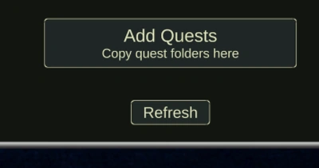

[English](README.md) | [Українська](README.ua.md) | [Русский](README.ru.md)

# Text Quest Reader

Ридер текстовых квестов для запуска ветвящихся сюжетных сценариев, вдохновлённый механиками игры «Космические Рейнджеры».

Вместе с инструментом [Text Quest Editor](https://github.com/albruevich/Text-Quest-Editor) образует систему для создания и запуска собственных текстовых квестов.

В отличие от аналогов, не привязан к конкретной игре или платформе — квесты можно использовать в любых проектах.

Поддерживает:
- локации и переходы  
- параметры и формулы  
- изображения  
- звуки и музыку  
- локальные и удалённые квесты (через API)  

Проект является open source и может использоваться:
- как готовый ридер текстовых квестов
- как пример интеграции JSON-квестов в Unity
- как основа для создания собственного ридера с кастомным UI

---

## Demo

---

## Быстрый старт

### Запуск из Unity

1. Откройте проект в Unity  
2. Откройте сцену:  
   `Assets/_Scenes/MainScene.unity`  
3. Нажмите **Play**

---

### Проверка работы

После запуска:

- выберите квест (например, **Asteroid Station**)  
- нажмите **Начать выбранный квест**

Если всё корректно — квест запустится.

---

## Готовые сборки

Скачать можно здесь:  
👉 https://github.com/albruevich/QuestReader/releases

### Как запустить

1. Скачать архив под свою платформу  
2. Распаковать  
3. Запустить `.exe` / `.app`

---

## Добавление квестов

Можно двумя способами:

### 1. Через папку

Поместите квест в:

Assets/StreamingAssets/Quests/

---

### 2. Через интерфейс

- **Добавить Квесты** — открывает папку квестов  
- **Обновить** — обновляет список  

Позволяет добавлять квесты без перезапуска приложения.

---

## Важно

Имя квеста в `quest.json`:

"questName": "YourQuest"

должно совпадать с названием папки.

---

## Структура квеста

Каждый квест — отдельная папка:

Assets/StreamingAssets/Quests/YourQuest/

### Содержимое:

- `quest.json` — логика и данные (обязательно)
- `Images/` — изображения (опционально)
- `Sounds/` — звуки (опционально)
- `Musics/` — музыка (опционально)

Структура создаётся автоматически в **Text Quest Editor**  
Создавать вручную не нужно.

---

## Создание квестов

Используется отдельный инструмент:  
👉 https://github.com/albruevich/Text-Quest-Editor

Позволяет:
- визуально создавать локации  
- настраивать параметры  
- задавать переходы  
- экспортировать готовый квест  

---

## Remote квесты (API)

Ридер поддерживает загрузку квестов с сервера.

### Возможности

- просмотр списка квестов  
- загрузка без копирования файлов  
- запуск удалённых квестов   

---

## Требования

### Unity (из исходников)
- Unity 6.4+

### Готовые сборки
- установка Unity не требуется 

---

## Ресурсы

- часть изображений сгенерирована AI  
- звуки и музыка: https://pixabay.com/

---

## Лицензия

MIT License

---

## Attribution

Если вы используете проект как основу для своего проекта или заимствуете части кода:

- укажите автора: **albruevich**  
- добавьте ссылку:  
  https://github.com/albruevich/Text-Quest-Reader
